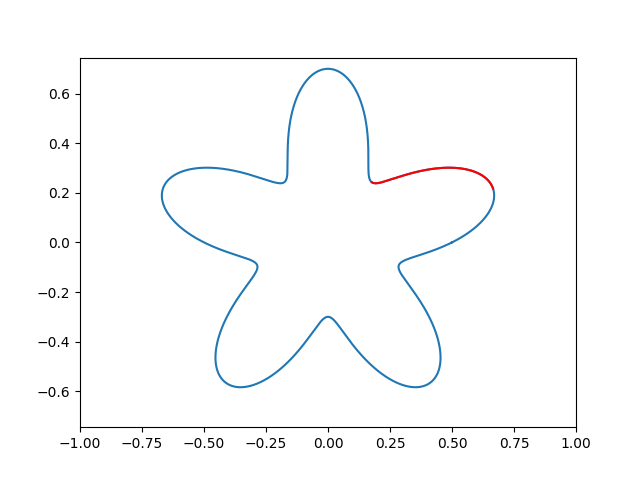

# 实验报告
## 题目
记函数$ \varphi(x) = r - (0.5 + 0.2sin(5\theta))$的零点集合为$G$, 使用参数曲线拟合图形$G$并分析.

## 概述
在这次实验中，我对函数图形进行了分析，包括一、二阶梯度，弦长，曲率等性质；实现了多项式曲线、Bezier曲线，并使用这两种参数曲线和第三方实现的B样条曲线对函数进行分段拟合；分析了采样点数、参数曲线及其次数、不同采样点的选择方法、不同数据点参数化方法，对拟合结果的影响。

实现的代码在：https://github.com/wkcn/cg-star

## 函数分析
将函数$\varphi(x) = 0$转为平面直角坐标系下的方程，并进行求导：

$r = 0.5 + 0.2sin5\theta$

$x = rcos\theta = (0.5 + 0.2sin\theta)cos\theta$

$y = rsin\theta = (0.5 + 0.2sin\theta)sin\theta$

$\frac{dx}{d\theta}=cos5\theta cos\theta-sin\theta(0.5+0.2sin5\theta)$

$\frac{dy}{d\theta}=cos5\theta sin\theta+cos\theta(0.5+0.2sin5\theta)$

$\frac{d^2x}{d\theta^2}=(-5.2sin5\theta-0.5)cos\theta-2sin\theta cos5\theta$

$\frac{d^2y}{d\theta^2}=(-5.2sin5\theta-0.5)sin\theta+2cos\theta cos5\theta$

$\frac{dy}{dx}=\frac{dy}{d\theta}/\frac{dx}{d\theta}$

$\frac{d^2y}{dx^2} = \frac{d\frac{dy}{dx}}{d\theta} / \frac{dx}{d\theta}$

曲率：$K = \frac{|\frac{d^2y}{dx^2}|}{(1+{(\frac{dy}{dx})}^2)^{\frac{3}{2}}}$

根据上述公式画出函数$\varphi(x) = 0$(零点集合$G$)的各种性质：

图1中的三个图为极坐标形式表示，下面三个图为平面直角坐标系形式表示。

从左到右三列分别是函数$\varphi(x)=0$的零点、一阶导数$\frac{dy}{dx}$、二阶导数$\frac{d^2y}{dx^2}$. 为了方便显示，导数进行了[-10, 10]的截断。

图2中用极坐标以及平面直角坐标系的形式，展示了曲率(curvature)，弦长(chord length)和累计弦长。

容易计算出，零点集合$G$在极坐标中，最小半径对应的点的角度为$54^\circ + 72^\circ k, k \in Z$, 最大半径对应的点的角度是$18^\circ + 72^\circ k, k \in Z$. 区间$[18^\circ+36^\circ k, 54^\circ+36^\circ k], k \in Z$中的图形是相似的。

不失一般性，选择一个固定的k值并对这个区间进行拟合。比如，只拟合图3中的红色部分，其它部分也使用同样的方法拟合。

## 参数曲线公式 
我采用了三种参数曲线拟合图形$G$, 分别是：多项式曲线、Bezier曲线和B样条曲线。

- n次多项式曲线 

$p(t)=\sum_{k=0}^{n}a_kt^k, 0 \le t \le 1$, $p(t)$与$a_k$均为矢量。

- n次Bezier曲线

$p(t)=\sum_{i=0}^nd_iB_{i,n}(t), 0 \le t \le 1, B_{i,n}=C_n^it^i(1-t)^{n-i}$, $p(t)$与$a_k$均为矢量。

- k次B样条曲线

$p(u)=\sum_{i=0}^nd_iN_{i,k}(u)$, 其中，$N_{i,k}(u)$是k次B样条基函数。

## 拟合方法
可以将曲线公式写成$Ax=b$形式，再使用最小二乘法求解：$x=(A^TA)^{-1}A^Tb$

## 评估方法
对每一个预测出来的点分别求$\theta$值，代入公式$r = 0.5 + 0.2sin5\theta$, 并从极坐标转为平面直角坐标系，作为目标值。

计算每个点的预测值和目标值的差的二范数，求范数的均值。

$Average Error = \frac{1}{n} \sum_{i=1}^n||\hat y_i - y_i||_2$

## 数据点的选择(采样)
- 均匀采样

根据$\theta$值等距采样。

- 根据曲率采样

根据曲率$K$的倒数进行采样, 间距$D_i=\frac{1}{1+\frac{K_i}{\alpha}}$，$\alpha$为超参数。

## 数据点的参数化
对每个数据点确定相应的参数值$t_i$:

- 均匀参数法

节点在参数轴上等距分布

- 累加弦长法

节点间距为这两个节点的弦长，$t_0=0, t_i=t_{i-1}+|\Delta p_{t-1}|, i=1,2,...,n$, $\Delta p_i=p_{i+1}-p_i$

- 向心参数法

节点间距为这两个节点的弦长的开方，$t_0=0, t_i=t_{i-1}+|\Delta p_{t-1}|^{\frac{1}{2}}, i=1,2,...,n$, $\Delta p_i=p_{i+1}-p_i$

## 实验分析
- 不同采样点数M和不同次数k的拟合结果

使用均匀采样、均匀参数法、k次多项式拟合，不使用梯度信息，一个区间的采样点数量为M。

误差分析：
M\\k|k=1|k=2|k=3
---|---|---|---
M=2|0.08131|x|x
M=4|0.04624|0.02376|0.00459
M=6|0.03966|0.01988|0.00439

在方程次数不变的情况下，随着采样点数量增多，误差减小。M=4, k=3时已经能很好拟合了。

- 不同参数曲线公式

使用均匀采样、均匀参数法、不使用梯度信息，一个区间的采样点数量为M，曲线次数为3。

误差分析：
M\\func|Polynomial|Bezier|B-Spline
---|---|---|---
M=4|0.00459|0.00459|0.00459
M=6|0.00439|0.00439|0.00026
M=8|0.00408|0.00408|$6.760^{-5}$
M=10|0.00388|0.00388|$2.034^{-5}$

B样条曲线拟合的效果最好。多项式曲线和贝塞尔曲线的拟合效果一样，原因是将它们化为Ax=b的形式时，它们对应的矩阵A是相似的。

- 不同采样点的选择方法

使用均匀参数法、3次B-Spline拟合，不使用梯度信息，一个区间的采样点数量为M。

误差分析：
M\\采样方法|均匀采样|按曲率采样($\alpha=50$)
---|---|---|---
M=4|0.00459|0.00324
M=6|0.00026|0.00048
M=8|$6.760^{-5}$|0.00028
M=10|$2.034^{-5}$|0.00015

按曲率采样的目的是让曲率大的地方数据点更多，在曲率小的地方数据点更少。而实验中，均匀采样和按曲率采样得到的数据点位置比较接近，误差也比较接近，原因是按$\theta$均匀采样的点也是曲率大的地方数据点多，曲率小的地方数据点小。

- 不同数据点的参数化方法

使用均匀采样，3次B-Spline拟合，不使用梯度信息，一个区间的采样点数量为M。

误差分析：
M\\参数化方法|均匀参数法|累加弦长法|向心参数法
---|---|---|---
M=4|0.00459|0.00410|0.00332
M=6|0.00026|0.00161|0.00073
M=10|$2.034^{-5}$|0.00017|$7.036^{-5}$

在本次实验中，当采样点数量比较少时，向心参数法效果最好；当采样点数量比较多时，均匀参数法效果最好。

## 实验总结
在这次实验中，我发现有很多因素会影响拟合的效果，而且不同方法在不同问题上的效果是不一样的，要根据具体的问题选择合适的方法。
